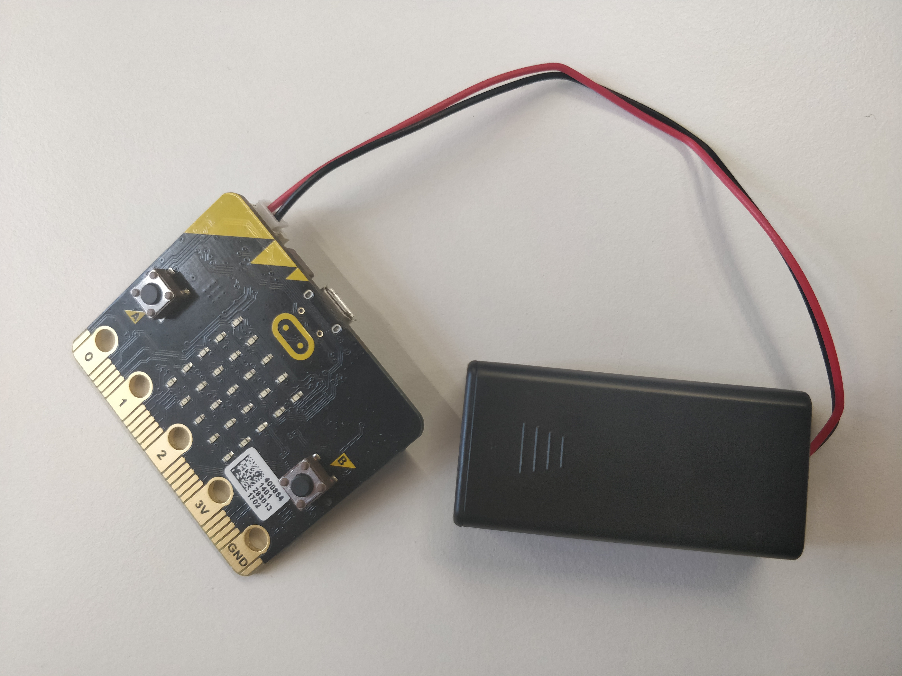

# 1. harjoitus: Ledi-ja-virtapiiri
Ensimmäinen microbit -harjoitus

Tarvittavat välineet:

Micro:bit, paristokotelo, johtimia ,100 Ohmin vastus, haluamasi värinen ledi, 

Micro-bit-harjoittelua/IMG_20180502_133946.jpg

Ohjeet:

Rakenna suljettu virtapiiri jossa LED palaa. Käytä kytkennässä 100 Ohmin vastusta rajoittamaan virtaa:

Kytkentäkaavio:

# 2. harjoitus: Micro:bitin ohjaaminen ja tervehdysteksti

Harjoittele koodin kirjoittamista ja lataamista Micro:bittiin.

Pääset kirjoittamaan koodia täällä: http://python.microbit.org/v/1

Ohjeet:

# 3. harjoitus: Ledi-ja-nappi

Kirjoita koodi, jonka avulla ledi syttyy, kun nappi a painetaan pohjaan ja Micro:bit näyttää tekstin: "lamppu päällä!

# 4. harjoitus: Musiikkia Micro:bitillä

Tee joku biisi ja soita se

# 5. harjoitus: RGB-ledin ohjaaminen

Eri värejä! Siistiä!
